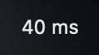

# PingBar

A menu bar app for macOS. It shows the round trip time to one host, for example `42 ms`,
and updates it every second. There is no window and no Dock icon.



## Build

```sh
./build.sh          # makes build/PingBar.app
open build/PingBar.app
```

To install it:

```sh
cp -R build/PingBar.app /Applications/
```

## Use

Click the value in the menu bar to open the menu:

- Select the host: `1.1.1.1`, `8.8.8.8`, `9.9.9.9`, `apple.com`, or `Other Host...`
- `Open at Login` starts the app with the Mac.
- `Quit PingBar`

The value becomes red `-- ms` when a reply does not come in 3 seconds.
`Restart Ping` starts a new ping process, which is useful after a network change.

## How it works

`Sources/main.swift` starts one `/sbin/ping -i 1 -n <host>` process and reads each reply
line as it comes. An open ICMP socket does not follow a route change, so the process is
replaced when it stops, when the Mac wakes, when `NWPathMonitor` reports a different
network path, and when no reply comes for 8 seconds.
The host is kept in `UserDefaults` (`defaults read com.github.cameralis.pingbar host`).
